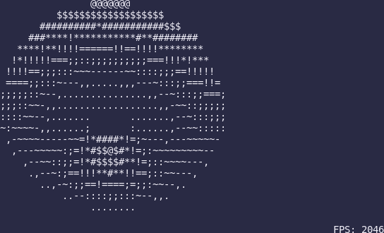

# Blazingly Fast Rust Donut

This Rust program generates a rotating donut in the terminal using ASCII art. The main mechanism involves mathematical transformations and buffer manipulations to create the illusion of a 3D object in motion.

## Running the Program

- **Install Rust:** Ensure you have Rust installed on your system. If not, you can download it from [the official Rust website](https://www.rust-lang.org/tools/install).
- **Install crate:** `cargo install blazingly_fast_rust_donut`
- **Run:** `blazingly_fast_rust_donut`

## Notes

- The rendering loop is set to run indefinitely. You can terminate the program by pressing `Ctrl+C` in the terminal.
- The program's performance may vary based on the terminal's capabilities and the system's hardware specifications.

## License

MIT
